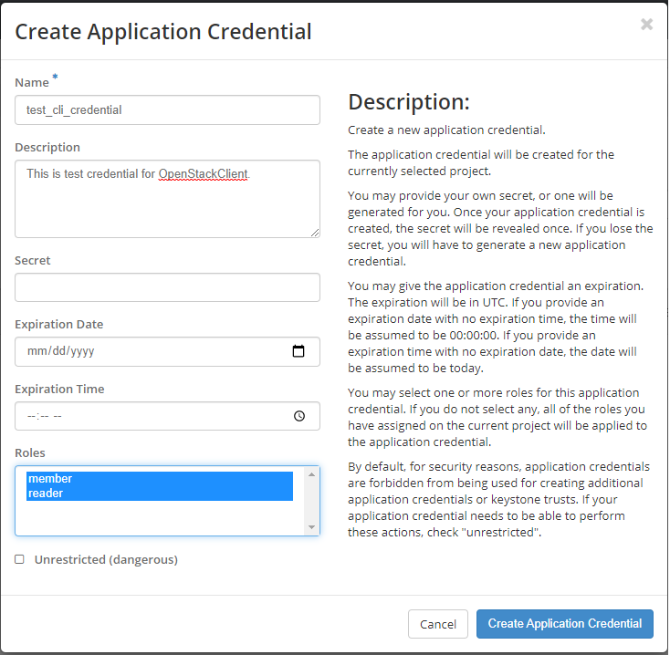
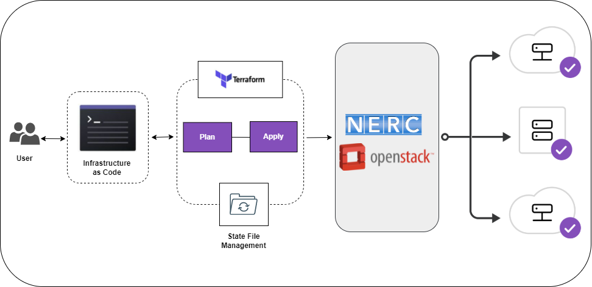

# Provisioning the NERC resources using Terraform

This includes a basic template to provision and manage user's NERC OpenStack resources using Terraform.
[NERC](https://stack.nerc.mghpcc.org) has an OpenStack deployment.
[Terraform](https://www.hashicorp.com/products/terraform/infrastructure-as-code)
is an open-source Infrastructure as Code (IaC) software tool that works
with NERC and allows you to orchestrate, provision, and manage infrastructure
resources quickly and easily.

## Benefits of Terraform

If you have multiple instances/ VMs you are managing for your work or research,
it can be simpler and more reproducible if you are doing it with automation tool
like **Terraform**.

## Installing Terraform

To use Terraform you will need to install it from [here](https://www.terraform.io/downloads).

## Basic Operations

The basic setup is as follows:

1. Git clone this `terraform-nerc` repo.

2. Generate and move a new SSH key pair to your local `~/.ssh` folder.

3. Download the NERC's OpenStack RC file i.e. `-openrc.sh` file into the repo.

4. Run `source *-openrc.sh`.

5. Review `example.tfvars` file in the repo and change some of the local variables' values as per your settings i.e. quantity, keypair-name, keypair-path, secgroup, network_name, etc.

6. Initalize Terraform in the repo with `terraform init`.

7. See what changes Terraform wants to make to your infrastructure with `terraform plan -var-file="example.tfvars"`.

8. Apply the changes with `terraform apply -var-file="example.tfvars"`.

9. The terminal will show the Floating IP(s) of the newly creted instance(s). Try to SSH into it using `ssh ubuntu@<Floating_IP> -i ~/.ssh/your-private-key-pair.key`.

10. Go to the [NERC's OpenStack dashboard](https://stack.nerc.mghpcc.org) to review your newly provisioned resources.

11. Clean up all resources using `terraform destroy -var-file="example.tfvars"`.

## How to get Credential to connect NERC's OpenStack

You can download the environment file with the credentials from the OpenStack dashboard.

- Log in to the [NERC's OpenStack dashboard](https://stack.nerc.mghpcc.org), choose the project for which you want to download the OpenStack RC file.

- Navigate to **Identity > Application Credentials**.

- Click on "Create Application Credential" button and provide a **Name** and **Roles** for the application credential. All other fields are optional and leaving the "Secret" field empty will set it to autogenerate (recommended).

- After clicking "Create Application Credential" button, the **ID** and **Secret** will be displayed and you will be prompted to `Download openrc file` or to Download `clouds.yaml`. Both of these are different methods of configuring the client for CLI access. Please save the file.

Then, source your downloaded **OpenStack RC File**:

Find the file (by default it will be named the same as the application credential name with the suffix `-openrc.sh` where project is the name of your OpenStack project).

Source the file:

    [user@laptop ~]$ source app-cred-<Credential_Name>-openrc.sh

**NOTE:** When you source the file, environment variables are set for your current shell.

## How to Setup SSH key pairs

Create a new key running: `ssh-keygen -t rsa -f username-keypair`

Make sure the newly generated SSH key pairs exist on your `~/.ssh` folder.

## Running Terraform

The Terraform deployment workflow on the NERC looks like this:

### Terraform Init

Initialize - Install the plugins Terraform needs to manage the infrastructure.

### Terraform Plan

Plan - Preview the changes Terraform will make to match your configuration.

### Terraform Apply

Apply - Make the planned changes.

## Track your infrastructure and Collaborate

Terraform keeps track of your real infrastructure in a state file, which acts as
a source of truth for your environment. Terraform uses the state file to determine
the changes to make to your infrastructure so that it will match your configuration.
Terraform's state allows you to track resource changes throughout your deployments.
You can securely share your state with your teammates, provide a stable environment
for Terraform to run in, and prevent race conditions when multiple people make
configuration changes at once.

For more info [read this](https://nerc-project.github.io/nerc-docs/openstack/advanced-openstack-topics/terraform/terraform-on-NERC/).
